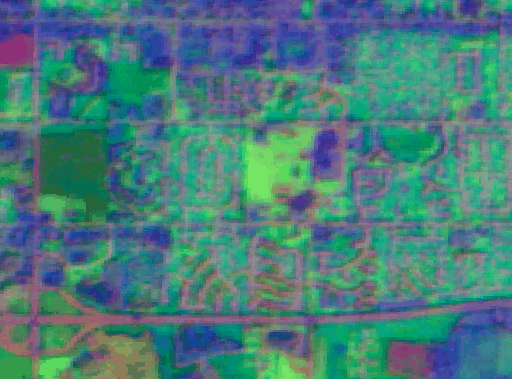

<p align="center">
  
</p>

<h1 align="center">GreenCredit Copilot</h1>

<p align="center">
  <strong>Multimodal AI agent for green finance — from a photo and a conversation to a financing recommendation.</strong>
</p>

<p align="center">
  <code>Gemini 2.5 Flash</code> &nbsp;&middot;&nbsp;
  <code>Google ADK</code> &nbsp;&middot;&nbsp;
  <code>AlphaEarth Foundations</code> &nbsp;&middot;&nbsp;
  <code>Google Solar API</code> &nbsp;&middot;&nbsp;
  <code>Document AI</code> &nbsp;&middot;&nbsp;
  <code>Vapi Voice</code>
</p>

---

## The Problem

Small and medium businesses want to go green but face a maze of financing programs, technical assessments, and eligibility requirements. Getting a single answer — *"What should I do, and how do I pay for it?"* — currently requires an energy auditor, a financial advisor, and weeks of paperwork.

## The Solution

GreenCredit Copilot is a **multimodal AI agent** that interviews the user by voice, analyzes their building from a photograph, pulls real satellite and solar data, runs physics-based energy calculations, and returns a clear financing recommendation — all in under 60 seconds.

---

## How It Works

```
  Voice Interview          Photo Upload           Address + Coords
       |                       |                        |
       v                       v                        v
  +---------+          +---------------+         +-------------+
  |  Vapi   |          | Gemini Vision |         | Earth Engine |
  | WebRTC  |          | wall material |         |  AlphaEarth |
  |  + STT  |          |  windows, roof|         |  embeddings |
  |  + TTS  |          |  cracks, etc. |         |  stability  |
  +---------+          +---------------+         +-------------+
       |                       |                        |
       +----------+------------+------------+-----------+
                  |                         |
                  v                         v
        +------------------+      +------------------+
        |  Heat Loss Engine|      |  Google Solar API |
        |  EN ISO 6946     |      |  rooftop panels   |
        |  EN 12831        |      |  financial data   |
        +------------------+      +------------------+
                  |                         |
                  +------------+------------+
                               |
                               v
                  +-------------------------+
                  |    Gemini 2.5 Flash      |
                  |    (Google ADK Agent)     |
                  |                          |
                  |  Combines all signals    |
                  |  into a financing        |
                  |  recommendation with     |
                  |  payback, savings, CO2   |
                  +-------------------------+
                               |
                               v
                    Beautiful React Dashboard
```

---

## Google Services Used

| Service | What It Does |
|---------|-------------|
| **Gemini 2.5 Flash** | Multimodal reasoning — analyzes building photos, generates recommendations, extracts voice data |
| **Google ADK** | Agent orchestration with tool use — coordinates all API calls in a single reasoning loop |
| **AlphaEarth Foundations** | 64-dimensional satellite embeddings via Earth Engine — measures land-use stability over 7 years |
| **Google Solar API** | Real rooftop solar potential — panel count, energy output, financial analysis |
| **Google Cloud Document AI** | Utility bill parsing — extracts consumption, tariff rates, costs from PDF/image scans |
| **Vapi** | Voice AI platform — real-time conversational interviews via WebRTC |

---

## Key Features

**Voice-First Onboarding** — Talk to the AI advisor instead of filling forms. It asks smart follow-up questions and auto-fills the intake form from the conversation.

**Photo-to-Heat-Loss Pipeline** — Upload a building photo. Gemini identifies wall materials, windows, roof type, insulation signs, cracks, and degradation. These observations feed a deterministic physics engine (EN ISO 6946 / EN 12831) that estimates transmission and infiltration heat loss.

**Satellite Stability Analysis** — AlphaEarth Foundations embeddings quantify how stable the site's land-use context has been from 2017–2023. A score near 1.0 means low environmental risk for long-term investment.

**Real Solar Data** — Google Solar API provides actual rooftop geometry, panel capacity, energy output estimates, and financial analysis including federal incentives.

**Bill Intelligence** — Upload utility bills (PDF or photo) and Document AI extracts consumption patterns, tariff rates, and annual costs to calibrate the financial model.

**Dynamic Results Dashboard** — Stat cards, energy profiles, and "why this is the best option" insights are all generated dynamically from the agent's structured output — not hardcoded.

---

## Quick Start

### Prerequisites

- Python 3.12+, [uv](https://docs.astral.sh/uv/), Node.js 20+
- Google Cloud project with Earth Engine, Solar API, and Document AI enabled
- API keys for Gemini, Solar, and optionally Vapi

### 1. Clone and install

```bash
git clone https://github.com/michal-zakrzewski/warsaw-hackathon-2026.git
cd warsaw-hackathon-2026
uv sync
cd frontend && npm install && cd ..
```

### 2. Configure environment

```bash
cp .env.example .env
cp .env.example green_agent/.env
# Fill in your API keys in both files
```

| Variable | Required | Service |
|----------|----------|---------|
| `GOOGLE_API_KEY` | Yes | Gemini |
| `EARTH_ENGINE_PROJECT` | Yes | Earth Engine |
| `GOOGLE_SOLAR_API_KEY` | Yes | Solar API |
| `VAPI_PUBLIC_KEY` | Optional | Voice assistant |
| `GOOGLE_CLOUD_PROJECT` | Optional | Document AI |

### 3. Authenticate Earth Engine (first time only)

```bash
uv run earthengine authenticate
```

### 4. Start all services

```bash
# Terminal 1 — ADK Agent (port 8000)
uv run adk api_server . --port 8000

# Terminal 2 — Voice Server (port 8001)
uvicorn voice_server:app --port 8001

# Terminal 3 — Bill Intelligence (port 8002)
cd bill_intelligence && uvicorn main:app --port 8002

# Terminal 4 — Frontend (port 5173)
cd frontend && npm run dev
```

Open **http://localhost:5173** and click **Start**.

---

## Project Structure

```
warsaw-hackathon-2026/
├── green_agent/               # ADK agent — Gemini + tool orchestration
│   ├── agent.py               #   Agent definition + system instructions
│   ├── tools.py               #   Satellite, solar, heat-loss tool wrappers
│   └── heat_loss_tools.py     #   Deterministic physics engine (EN ISO 6946)
├── src/satellite_embedding/   # Earth Engine connector for AlphaEarth
├── solar_client/              # Google Solar API client
├── bill_intelligence/         # Document AI bill parsing pipeline
├── voice_server.py            # Vapi voice interview backend
├── frontend/                  # React + Vite + Tailwind SPA
│   ├── src/pages/
│   │   ├── IntakeForm.tsx     #   Voice + photo + bills intake wizard
│   │   ├── AnalysisLoading.tsx#   Multimodal prompt builder
│   │   └── Results.tsx        #   Dynamic results dashboard
│   └── src/components/
│       └── VoiceChat.tsx      #   Vapi WebRTC voice panel
├── scripts/
│   └── generate_embedding_gif.py  # AlphaEarth temporal GIF generator
├── demo/
│   ├── demo_factory.png       # Test photo for Warsaw scenario
│   └── embedding_timelapse.gif# AlphaEarth visualization
├── DEMO_SCENARIOS.md          # Two pre-tested demo walkthroughs
└── README_VOICE.md            # Voice subsystem documentation
```

---

## Demo Scenarios

See **[DEMO_SCENARIOS.md](DEMO_SCENARIOS.md)** for two pre-tested walkthroughs:

| Scenario | Location | Features Showcased |
|----------|----------|--------------------|
| **US Farm** | Mountain View, CA | Solar API + Satellite stability + USDA grants |
| **Warsaw Factory** | ul. Annopol 4, Warsaw | Photo vision + Heat loss + Solar + Satellite |

**The wow moment:** Upload a photo of a building and enter the floor area. The AI examines the facade, identifies glass curtain walls, counts floors, and runs a physics-based heat-loss calculation — all from a single image and one number.

---

## AlphaEarth Satellite Embeddings

<p align="center">
  
  <br />
  <em>RGB visualization of 3 embedding dimensions (A05, A15, A30) across 2017–2023.<br/>
  Stable colors = stable land use = lower investment risk.</em>
</p>

The [Satellite Embedding dataset](https://developers.google.com/earth-engine/datasets/catalog/GOOGLE_SATELLITE_EMBEDDING_V1_ANNUAL) from Google DeepMind's AlphaEarth Foundations provides 64-dimensional embedding vectors at 10m resolution for every terrestrial point on Earth. We use it to assess whether a site's environmental context has been stable over time — a key signal for long-term green investment viability.

Generate your own visualization:

```bash
uv run python scripts/generate_embedding_gif.py <lat> <lon> [output.gif]
```

---

## Security

This project implements several security hardening measures:

- CORS restricted to localhost origins on all backend services
- Path traversal protection — `local_file` document source type is disabled
- Proper HTTP error responses (no information leakage)
- File upload size limits (10 MB images, 15 MB bills)
- Session storage cleanup between analyses
- Safe JSON parsing with graceful fallbacks
- No hardcoded secrets — all credentials via environment variables
- `.gitignore` covers `.env`, `.adk/`, `transcripts/`, service account keys

---

## Team

Built at the **Warsaw Google Hackathon 2026** by:

- [Michal Zakrzewski](https://github.com/michal-zakrzewski)
- [Pablo Knappo](https://github.com/pabloknappo)

---

<p align="center">
  <sub>Built with Google Cloud, Google DeepMind AlphaEarth Foundations, and a lot of coffee.</sub>
</p>
